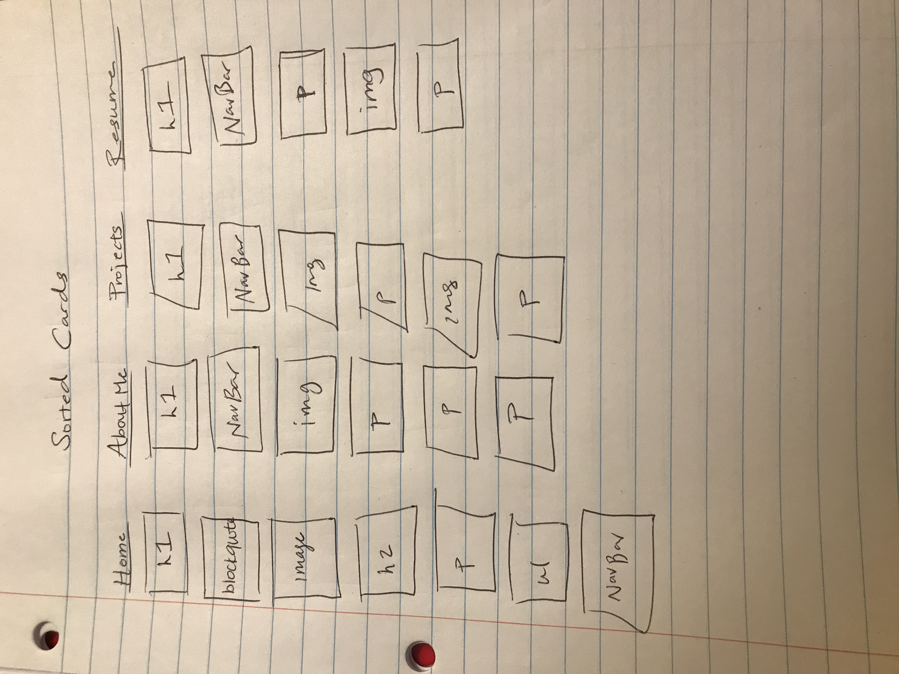

# Project 1 - Design Journey

**For each milestone, complete only the sections that are labeled with that milestone.**

## Markdown Instructions

This is a Markdown file. All written documents that you will submit this semester will be Markdown files. Markdown is a commonly used format by developers and bloggers. It's something that you should know.

The following links are Markdown references:
- <https://guides.github.com/features/mastering-markdown/>
- <https://github.com/adam-p/markdown-here/wiki/Markdown-Cheatsheet>

When writing your Markdown file in Atom. Open the command palette and search for **Markdown Preview: Toggle**. This will open up a panel in Atom where you can preview your formatted Markdown file.

This is how your insert images into your Markdown documents:

## Milestone 1

**Make the case for your decisions using concepts from class, as well as other design principles, theories, examples, and cases from outside of class.**

You can use bullet points and lists, or full paragraphs, or a combo, whichever is appropriate. The writing should be solid draft quality but doesn't have to be fancy.

### Website Topic (Milestone 1)

I plan on creating a portfolio web page for myself. My website will my resume, past projects, and highlight impressive achievements. It will provide insight into my interests, personality, and goals for the future. My web page will serve as a simple and effective way for me to network and introduce myself to my target audience.

### Target Audience (Milestone 1)

The target audience for my website is recruiters and hiring managers interested in hiring a product designer. As I apply for internships and jobs, my webpage will be used for these people to learn more about me and see examples of my work and experience. This is my target audience since they will want to know more about me as I apply for jobs, and the information I provide will be crucial to the hiring process. I will be showcasing my skills and experience.

### Final Content (Milestone 1)

I plan to include an 'about me' tab with a few paragraphs about myself and my career and academic interests as well as types of jobs I am seeking , description of my interests, and list of skills I have. I will also include lists describing my professional experience and contact information, a tab called projects linking to a page with all my projects, and a tab called resume linking to a page with my resume.

### Home Page Content (Milestone 1)

-My name

-A photo of myself: I think it is important for recruiters and hiring managers to know who they are reviewing and get a glimpse of who might be working for them in the future. It also will make the audiences feel more connected to me and get a feel for who they are about to learn about

-A paragraph called "Hey It's Hameedah" with a brief description about myself: It will be important for my target audience to learn a little about me and where I am from before getting into the more detailed aspects of my portfolio.

-A list of my contact information in a section called "Let's Connect": In case there is a need to contact me, my audience can quickly find out how to reach me. Also, if they want to hire me they know where to reach me!

-An inspiring blockquote telling recruiters a little more about me and what kinds of things inspires me

-Tabs leading to an about me page, projects, and my resume, all providing my audience with more detailed info about myself.

It will include all the important things that recruiters would want to see initially. Giving them a good grasp of who I am and what kind of job I am seeking.

---

## Milestone 2

**Make the case for your decisions using concepts from class, as well as other design principles, theories, examples, and cases from outside of class.**

Each section is probably around 1 reasonably sized paragraph (2-4 sentences).

### Target Audience (Milestone 2)

My target audience is recruiters and hiring managers who are seeking to employ a product design intern.They will be interested in seeing past work of mine, and about the skills I have with regards to design and coding. They will also be interested in seeing my resume to learn a little bit more about me and my coursework.

### Organization & Navigation (Milestone 2)

The sites content was strategically implemented considering what the recruiters are looking for. I knew that projects would be super important and need a section for themselves. My resume was also important and needed to be highlighted. I considered adding a category for a photo gallery but decided that the projects category would be sufficient in portraying my work to recruiters.

I thought that is was important to sort the content of the site into these 4 sections (home, about, resume, and projects).

I knew I wanted my home page to be not as text heavy, but to serve as a quick intro to me, giving recruiters a feel for who I am. Thus, I included a photo of me, blockquote of an inspiring quote I like, and a list of my contact info.

I aimed to have each section only include info that was relevant to it, thus the card sorting process was very important.

### Final Organization and Navigation (Milestone 2)

In order to organize the content of my website, I had to consider what information I wanted to display upfront and what I wanted to display in the other tabs of the site. The tabs were created with recruiters in mind, each category leading to some aspect relevant to the hiring process, giving more details about myself as a potential design intern candidate.

I decided to group the content (the cards) into 4 distinct sections: home page, about me, projects, and resume.

The home page, I felt, should include very little info so that it can be visually appealing, but still relay the information it needs to (photo of me, inspiring quote, contact info, and quick paragraph about me). Thus, I made it brief and it only included info that will give recruiters a quick intro to who I am.

Next, the about me category was pretty simple. I included a photo of me and a few paragraphs about me. This is where I really got into my qualifications, giving recruiters more to go off of when making hiring decisions.

My third category was projects and it was pretty simple. I added titles of the projects and pictures relating to them. Recruiters will find it very useful to learn about me and projects make me a better candidate for design roles.

Last, the resume category which just consisted of a pic of my resume. This makes it easy for hiring managers and recruiters to get a run down on basically everything they need to know about me.

All categories included the Nav Bar and H1 heading.  

---

## Milestone 3

**Make the case for your decisions using concepts from class, as well as other design principles, theories, examples, and cases from outside of class.**

Remember to focus on the things we can't see just by looking at the site: changes, alternatives considered, processes, and justifications.

Each section is probably around 1 reasonably sized paragraph (2-4 sentences).

### Theme Ideas (Milestone 3)

My first idea was to make a website that haas a very technological feel to it. This is appropriate for my target audience since my webpage is aimed towards tech recruiters looking for designers to work with engineers to build a product. I plan on using darker colors to convey this theme.

Another idea I had was to make a website that gives off a creative and calming vibe. I decided on this theme since design work is all about creativity and individuality. My target audience would be interested in this since it tells them about my eye for design and creativity.  

### Theme Design (Milestone 3)

[Discuss your theme designs: how did you come to them, what are their strengths and weaknesses, how do they fit your overall design goals and audiences?]

[Emotion is a big part of design. What emotions where you thinking about or trying to convey in your designs?]

For the first theme design I knew I wanted to create a website with a very tech and industrial feel. In order to do this, I included hues of gray and gave it a black background. These are colors that remind me of technology, and that I felt would remind recruiters of the same. I decided to use a sans-serif font since I wanted texts with blunt edges, giving off a more serious and professional feel. A weakness of this design is that the black background makes it difficult to use dark texts in the webpage. However, some strengths are that this theme gives off the technical feel while allowing me to still show my creativity (use of purple text for headings). I am trying to portray a serious emotion with this design, I want recruiters to know I am professional and ready to work!

My second design was made with the intention of being more laid-back and creative. I wanted to convey joy and happiness. Design is supposed to be enjoyable and pleasing to look at, so I wanted my webpage to reflect this. I chose pale/soft colors in order to do this. The light colors create an aura of relaxation. This design's strength is that it gives recruiters a feel for my design creativity. A weakness is that the color combination I chose to use (yellow/pink) may not be appealing to all eyes. I used serif fonts here to add to the creative feel, and give the page more character. My design goals included making a creating that tells MY story while conveying the information it needs to my target audience in an effective way. I believe that both designs do this well, though, I think design 2 does it a bit better.

---

## Final Submission - Rationale

**This rationale should be polished writing: one you might submit as a report to a client or boss to help explain the project and convince them you did a good job. You'll be surprised how much writing and communicating you need to do about projects and choices on internships and jobs; practice that here.**

It should be a comprehensive, complete story of the project. You might find that each section runs a few paragraphs (1-2). Sketches can often help tell the story of your design. Screenshots are also useful for describing issues discovered during the design process and how you addressed them.

Your rationale should be a polished version of the earlier explanations.

### Site Layout (Final Submission)

[Show your design process and final layout for your site. You must include photos of your sketches of the layout. No digital drawings permitted.]

I knew that I wanted a simple and easy to navigate site, so I went in my design process with the mindset that it will be a simple design with not too much crowding each page. Thus, I decided on the 4 sections/pages using this logic.

From there, I designed each page to display information in a simple fashion. I wanted my target audience to be able to find the information they need in a quick manner.

### Audience (Final Submission)

The intended audiences are recruiters and hiring managers who are looking to hire a product design intern. I know that this demographic will interested in seeing my work experience, learning about my education and coursework, and would want to know a little bit about me as a person. I know that they will need to see my resume to learn a little bit more about me and my coursework.

### Design Goals (Final Submission)

-my main goal is to create a design that is easily to navigate and simplistic
-my design should convey my liking for design and provide recruiters with all necessary info they need to make hiring decisions for product design interns.
### Navigation (Final Submission)

-The  navigation I chose met my goals because it categorically separates my webpage into 4 distinct sections that my target audience would want to see.

### Organization (Final Submission)

I organized my site very strategically, I chose to include info that I know my target audeince would need to see.
My home page introduces me to my audience and gives them a breif understanding of my goals and rationale for making the site/ for why I should be hired as a product design intern.
The home page, includes a minimal amount of info so that it can be visually appealing, but still relay the information it needs to. I chose to make it brief and it only included info that will give recruiters a quick intro to who I am.

Next, the about me page: I included a photo of me and a few paragraphs about me and my experience and technical skills. This is where I really got into my qualifications, and was able to give recruiters a more in depth run down of my qualifications.

My third category was projects: I added titles of the projects and pictures relating to them, and summary of what the project entailed.

Last I had a resume page in my navigation. This is an essential piece that recruiters use to analyze possible interns. I knew it would be important to have a section for this.

### Visual Design (Final Submission)

For the first theme/visual design I met my goals by ceating a website with a very tech and industrial feel, that my target audience may be used to given the industry they work in. I included colors that remind me of technology (grey, black, etc. ), and that I felt would remind recruiters of the same. I believe that I was able to convey a serious emotion with this design and show recruitersI am professional and ready to work!

My second design allowed me to display a more creative side. joy and happiness were reflected in this. I think it is important for future employers to see they the people they are hiring are personable and relatable. This was my goal, to create a welcoming environment. Design work is supposed to be enjoyable and pleasing to look at, so I mirrored this sentiment in my page. I chose pale/soft colors in order to do this. The light colors create an aura of relaxation.

### Self-Reflection (Final Submission)

In this assignment I learned the importance of the target audience, and how designs can be changed drastically based on who the target audience is. I also learned and experienced the amount of work that goes in to creating websites, and the attention to detail that it takes. HTML and CSS use various elements and strategies to create functionally designed sites. I learned the importance of structure and visual design and how they must complement each other. A lot of work goes into developing webpages and I have so much more to learn!

 
